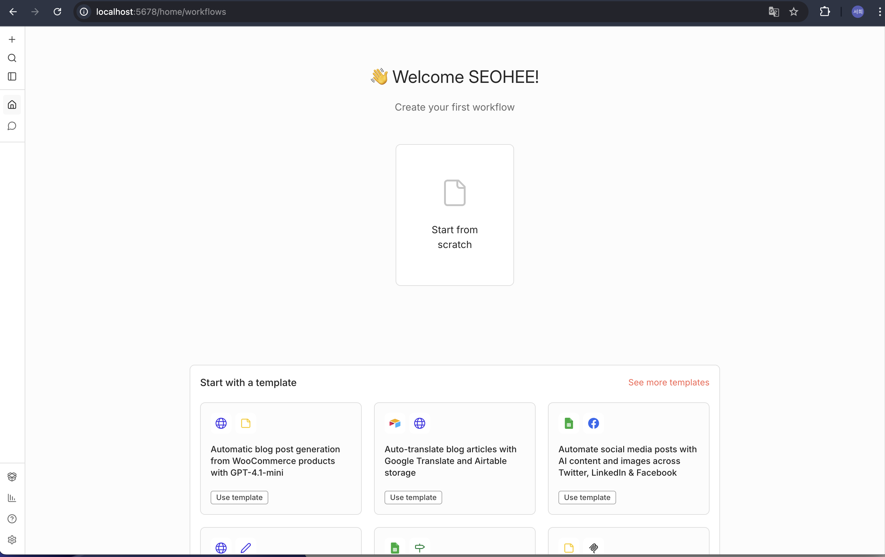
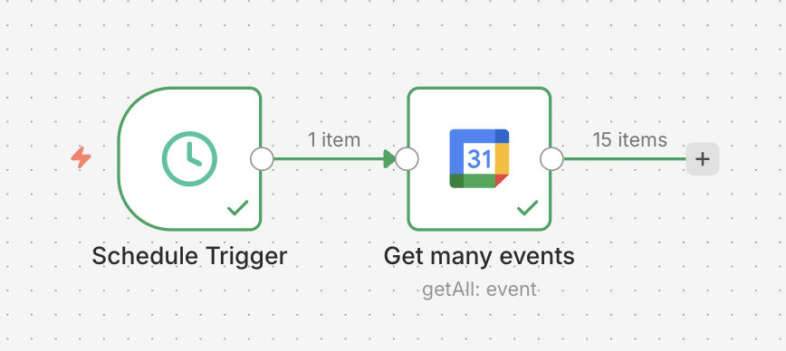
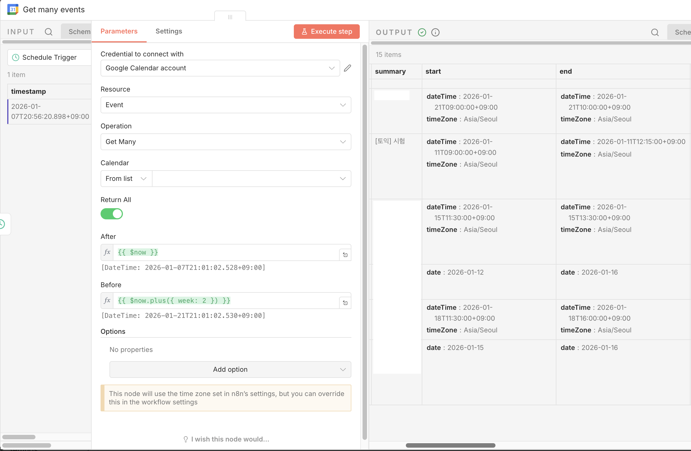
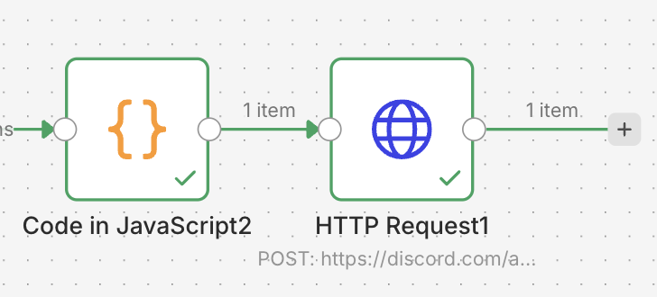
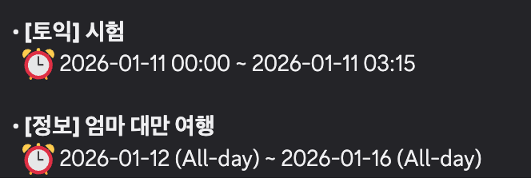

# PART 2 | AI 기반 운영 자동화 및 시스템 연동기

## 04. GPT를 사용한 리뷰 자동화 시스템 구축기
> 리뷰 요약, 라벨링, 인사이트 리포트 생성 자동화로 업무 효율을 극대화하다.

- 팀과 업무에서 가장 반복적이고 많은 시간을 소모하는 부분을 자동화하면, 보다 핵심적인 가치에 집중할 수 있다.
- 특히 인사이트 분석은 담당자의 분석 역량에 따라 결과의 깊이가 크게 달라지는데, 프롬프트를 잘 설계하면 일정 수준 이상의 일관된 인사이트를 얻을 수 있다는 점이 인상 깊었다.

## 05. LLM을 활용한 당근 중고거래 운영 자동화 전환기
> 중고거래 운영 업무 사이클의 반복 업무를 자동화로 해결하다.

- 챕터 4와 마찬가지로, 반복적인 업무를 자동화하려는 시도 자체가 중요하다는 점을 다시 한 번 느꼈다.
- LLM 기능의 성능은 프롬프트 품질에 크게 좌우되기 때문에, 프롬프트 설계에 충분한 시간을 투자해야 한다.
- 모든 것을 완벽하게 구현하기보다는 MVP를 설정하고 빠르게 시도해보는 접근이 효과적이라는 점이 주요 메시지였다.
- 자동화는 목적이 아니라 도구이며, 이를 통해 사람은 사람이 해야 할 일에 더 집중할 수 있다는 점이 인상 깊었다.

## 06. 작은 팀, LLM으로 큰 업무효율 내기
> LLM, MCP, n8n을 활용해 업무 효율성을 크게 향상시키다.

- 새벽에 에러 알림이 발생하면, 즉시 대응이 필요한 상황인지 아니면 다음 날 업무 시간에 확인해도 되는지를 판단하는 데만 30분에서 1시간 정도가 소요되곤 했다.
- 이를 해결하기 위해 새벽에 알림이 발생하면, 문제가 된 코드를 GitHub MCP를 통해 가져오고 LLM이 에러의 중요도를 자동으로 판단하도록 구성했다.
- 그 결과 에러의 원인과 영향 범위를 빠르게 파악할 수 있어, 전체적인 에러 대응 시간이 크게 단축되었다.
- 또한 LLM은 한 번에 너무 많은 정보를 주면 일부 내용을 놓칠 수 있기 때문에, 작업을 단계별로 나누는 멀티턴 방식을 채택한 점이 인상 깊었다.
- 멀티턴이란 여러 번의 대화를 주고받으며 작업을 수행하는 방식이다.
- 해당 팀에서는 에러 식별 → 흐름 파악 → 로그 분석 → 코드 분석 → 종합 판단 → 결과 전달의 과정을 단계별로 나누어 분석하도록 구성했다.
- 이 자동화를 통해 새벽 대응 횟수가 감소했고, 에러 분석 시간 단축과 함께 온콜 스트레스도 크게 줄일 수 있었다.

## 용어 정리
- **VOC**
  - Voice Of Customer의 약어로, 고객의 목소리를 의미한다.
  - 특정 상품이나 서비스에 대한 고객의 반응, 의견, 문의, 불만 등을 포괄하는 개념이다.
  - 당근은 `이웃 간의 따뜻한 연결`이라는 핵심 가치를 실현하기 위해 앱 리뷰 하나하나를 중요하게 다룬다.

- **빅쿼리**

  

  - 구글 클라우드 플랫폼(GCP)에서 제공하는 기업용 데이터 분석 서비스이다.
  - 구글이 내부적으로 사용하던 대규모 데이터 처리 기술을 외부 사용자도 사용할 수 있도록 상용화한 서비스이다.
  - 테라바이트(TB)에서 페타바이트(PB)급 데이터 분석을 주요 목적으로 한다.
  - 저장 용량과 쿼리 실행량에 따라 비용을 지불하며, 분산 처리는 구글이 자동으로 처리한다.
  - 기존 데이터베이스가 읽기/쓰기와 분석 작업 리소스를 공유하는 구조라면, 빅쿼리는 컴퓨팅 레이어와 스토리지 레이어를 분리해 시스템 성능에 영향을 덜 주는 구조를 가진다.

## 📝 읽고 나서
- 자동화를 활용해보고 싶었지만 어떻게 시작해야 할지 막막했는데, n8n 실제 사례를 접하며 직접 시도해보고 싶다는 생각이 들었다.

- 우선 도커로 n8n을 실행해보았다.
  - docker image pull
    ```shell
    docker pull n8nio/n8n:latest
    ```

  - docker-compose.yml 작성
    ```yaml
    services:
      n8n:
        image: n8nio/n8n:latest
        container_name: n8n
        ports:
          - "5678:5678"
        volumes:
          - n8n_data:/home/node/.n8n
        environment:
          TZ: Asia/Seoul
          N8N_TIMEZONE: Asia/Seoul
          GENERIC_TIMEZONE: Asia/Seoul
          N8N_BASIC_AUTH_ACTIVE: "true"
          N8N_BASIC_AUTH_USER: admin
          N8N_BASIC_AUTH_PASSWORD: 1234
        restart: unless-stopped

    volumes:
      n8n_data:
    ```

  - 도커 컨테이너 실행
    ```shell
    docker compose up -d
    ```

  - http://localhost:5678 로 접속

    

  - 간단한 워크플로우 설계

    

    - Schedule Trigger 노드는 지정한 시간이나 주기마다 워크플로우를 실행한다.
    - Google Calendar API와 연동해 개인 일정을 가져오도록 구성했다.

    

  - 이제 이 데이터를 Discord로 전송해보자.

    

    - Code 노드에서는 가져온 일정을 Discord에 출력하기 좋은 형태로 가공한다.
    - HTTP Request 노드에서는 가공된 데이터를 Discord 웹훅으로 전송한다.

    - Discord 출력 결과

    
  - 이로써 n8n을 활용해 구글 캘린더의 일정을 가져와 매일 아침에 알림을 주는 자동화를 실습해봤다.
  
### 참고 자료
- [뉴닉, [비즈니스 어휘] VOC: 고객의 목소리에 귀 기울여라](https://newneek.co/@booklenz/article/15883)
- [구글 클라우드, BigQuery 개요](https://docs.cloud.google.com/bigquery/docs/introduction?hl=ko)
