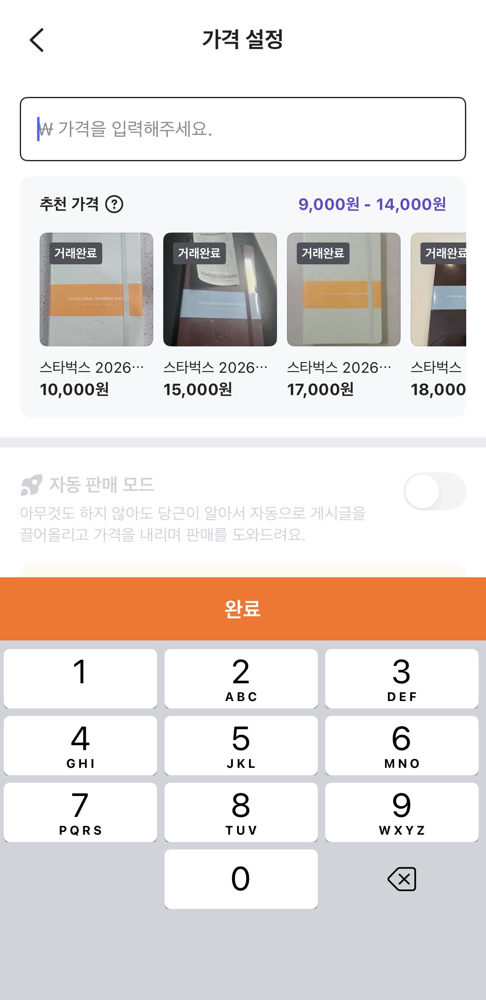

# PART 3 | LLM을 이용한 개발기

## 07. LLM으로 복잡한 게시글을 구조화하기까지
> LLM으로 비정형 데이터를 구조화하다.
- 모바일 쿠폰과 같은 비정형 게시글을 LLM으로 분류했다.
- 분류 오류가 발생할 경우 결과를 단순히 수정하지 않고, 오류가 반복되는 패턴을 수집해 기준을 점점 명확히 했다.
- 애매한 표현을 제거하고 판단 기준을 구체화할수록 LLM의 분류 결과가 안정적으로 개선되었다.
- 이 과정을 통해 LLM 활용의 핵심은 기준 설계이며, 필요한 정보를 명확히 정의하고 이를 얻기 위한 질문과 프롬프트를 구조화하는 것이 중요하다는 점을 확인했다.

## 08. LLM을 활용한 스마트폰 시세 조회 서비스 구축하기
> 가격을 설정할 때 시세를 조회할 수 있게 하다.
- 기존에는 스마트폰 상세 정보를 추출하기 위해 복잡한 정규식이나 전용 ML 모델이 필요했다.
- LLM 도입 이후 프롬프트 수정만으로 정보 추출 정확도를 빠르게 개선할 수 있었다.
- 프롬프트만으로 처리하기 어려운 예외는 BigQuery 뷰 테이블을 활용해 2차 가공했다.
- 주간 시세 집계와 같은 대용량 연산은 BigQuery에서 처리하고, 집계 결과만 MySQL에 저장했다.
- 사용자가 화면에 진입할 때는 MySQL을 통해 시세 조회 결과를 빠르게 제공했다.
- 유사 상품 추천을 위해 불필요한 키워드를 제거하고, 핵심 단어 일치 시 가산점, 불일치 시 감점을 적용했다.
- 임베딩 모델을 하나로 고정하지 않고 여러 모델을 테스트해 가장 결과가 좋은 모델을 선택했다.
- 이를 통해 LLM은 데이터 파이프라인과 함께 설계될 때 실서비스에 적합해진다는 점을 확인했다.

- 책을 읽으며 실제로 당근에 상품을 올릴 때 추천 가격을 미리 확인할 수 있어 가격 설정에 도움이 되었던 경험이 떠올랐다.

## 09. 3살 아가가 좋아할 만한 장난감 LLM으로 추천하기
> AI가 상황과 취향에 맞는 물품을 바로 찾아 준다면?
- 당근은 사용자의 활동 기록을 기반으로 개인화된 물품 추천을 제공하고 있다.
- 챕터에서 언급된 프롬프트 작성 노하우는 다음과 같다.
    - 영어로 작성하는 것이 상대적으로 더 좋은 결과를 보였다.
    - 중요한 조건은 대문자로 강조하면 반영도가 높아졌다.
    - 프롬프트를 설계할 때도 사용할 LLM을 활용하는 것이 좋다.

## 10. 연간 LLM 호출 비용 25% 절감, 인턴이 도전한 시맨틱 캐싱 도입 기록
>  AI 추천 메시지 기능에 시맨틱 캐싱 도입으로 비용을 크게 절감하다.
- **시맨틱 캐싱**은 문장의 표현이 달라도 의미가 유사한 요청에 캐시를 적용하는 방식이다.
- 시맨틱 캐싱 서버는 메인 서버와 분리된 애드온 형태로 구성했으며, 서버 간 통신은 gRPC를 사용했다.
- 채팅 발화는 대부분 짧기 때문에 고차원 벡터를 그대로 사용하는 것은 계산 비용 측면에서 비효율적이었다.
- 이를 해결하기 위해 주성분 분석(PCA)를 적용해 벡터 차원을 축소했다.
- 의미적으로 유사한 문장을 묶기 위해 DBSCAN 군집화 알고리즘을 사용했다.
- 캐시 히트율은 유의미한 수준으로 측정되었지만, 잘못된 추천 메시지가 노출되며 사용자 경험에 혼란을 주는 문제도 발생했다.
- 이를 보완하기 위해 메타데이터 기반 필터링을 적극적으로 활용할 계획이다.

## 용어 정리
- **업서트 작업(Upsert)** : 데이터가 존재하면 UPDATE, 존재하지 않으면 INSERT를 수행하는 데이터 처리 방식이다.
  - MySQL/MariaDB ➡️ `INSERT ... ON DUPLICATE KEY UPDATE`
  - PostgreSQL ➡️ `INSERT ... ON CONFLICT DO UPDATE`
- **필터 버블** : 사용자의 기존 취향만 강화되는 추천 현상이다.
  - 완화하는 방법으로 추천 결과에 의도적으로 다른 유형의 콘텐츠(트렌드 기반)를 섞기도 한다.
- **DBSCAN** : 밀도 기반으로 군집을 형성하는 클러스터링 알고리즘이다.
  - 밀도 기반이란 데이터 포인트가 일정 거리 내에 충분히 밀집한 영역만을 클러스터로 판단하는 방식이다.
  
  - 출처 : https://blog.dailydoseofds.com/p/hdbscan-vs-dbscan
  - 챕터 10에서 DBSCAN을 사용한 이유는 k-means는 모든 데이터를 강제로 묶지만, DBSCAN은 묶지 않아도 되는 선택을 할 수 있기 때문이다.

## 📝 읽고 나서
- 과거 임베딩 기반 유사도 추천 결과의 품질이 낮았던 경험이 떠올랐다.
- 당시에는 임베딩 모델을 교체해 테스트해볼 수 있다는 선택지를 고려하지 못했다.
- 이번 파트를 통해 임베딩 모델 선택 또한 추천 품질에 큰 영향을 미친다는 점을 다시 인식했다.

### 참고 자료
- [MariaDB, INSERT ON DUPLICATE KEY UPDATE](https://mariadb.com/docs/server/reference/sql-statements/data-manipulation/inserting-loading-data/insert-on-duplicate-key-update)