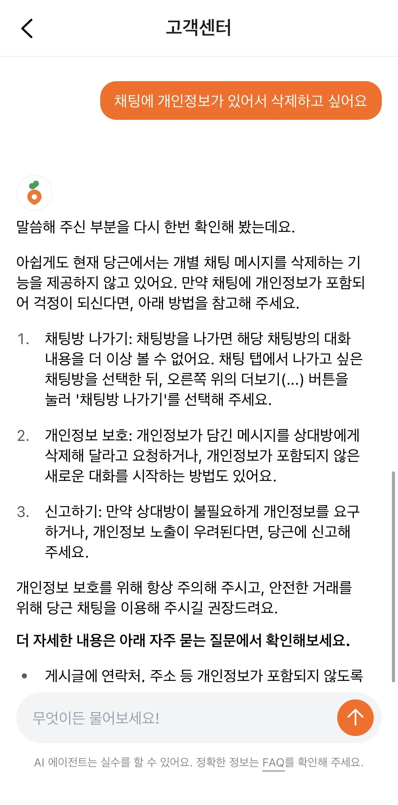

# PART 4 | AI 플랫폼과 AI 에이전트 개발기

## 11. VoC 플레이그라운드로 고객 목소리에 반응하는 당근 만들기
> LLM을 활용해 VoC를 동적으로 분류하고 분석하다.
- 기존에는 고객의 VoC를 수작업으로 분류했으며, 이를 개선하기 위해 VoC LLM 파이프라인 프로젝트를 시도했다.
- 사용자의 의견을 대분류와 중분류로 나누었으나, 개별 사용자의 고유한 관심사를 충분히 반영하지 못하는 한계가 있었다.
- 미리 정의된 분류 체계가 아닌, 사용자의 질문이나 관심사에 기반한 동적 필터링의 필요성을 느꼈다고 한다.
- 이를 해결하기 위해 VoC 플레이그라운드를 만들었으며, 필터를 활성화해두면 매일 아침 최신 데이터셋을 자동으로 확보할 수 있도록 했다.
- LLM을 활용해 VoC 데이터를 요약하고, 의미 있는 보고서 형태로 가공할 수 있었다.
- 이를 통해 고객의 목소리에 보다 빠르고 유연하게 반응할 수 있는 환경을 구축할 수 있었다.

## 12. 모든 당근 사용자에게 AI 에이전트 제공하기 - 1부
> 고객 문의 대응을 위한 멀티 AI 에이전트 설계
- FAQ 문서가 존재함에도 불구하고, 사용자는 검색보다 ‘바로 문의하기’ 기능을 주로 사용하고 있었다.
- 이로 인해 일일 문의량이 수천 건에 달했고, 고객센터 인력 확충이 필요할 수 있는 상황이었다.
- 문제를 해결하기 위해 고객 문의 대응용 AI 에이전트를 제공하기로 했다.
- AI 에이전트는 사고, 계획, 기억을 기반으로 다단계 작업을 수행하는 구조를 가진다.
- 하나의 에이전트가 모든 작업을 처리하지 않고, 기능별로 역할이 분리된 여러 에이전트를 동시에 사용하는 멀티 에이전트 구조를 채택했다.
- 이를 통해 운영 정책이 변경되더라도 해당 정책을 담당하는 에이전트만 수정하면 되므로 유연성이 높아졌다.
- 당근은 개인정보를 안전하게 AI에게 전달하기 위해 MCP 서버를 사용했다.
- 에이전트 간 협업을 위해 각 에이전트가 어떤 전문성을 가지는지 인식할 수 있어야 했다.
- 이를 위해 에이전트 디스크립션을 상세히 작성했으며, 역할, 해결 가능한 문제 유형, 사용 방법, 출력 형태 등을 명시했다.
- 에이전트의 입력 스키마와 출력 스키마를 정의해 다른 에이전트에서도 재사용 가능하도록 설계했다.

## 13. 모든 당근 사용자에게 AI 에이전트 제공하기 - 2부
> 신뢰 가능한 응답과 빠른 체감을 위한 에이전트 고도화
- LLM 모델이 점점 거대해지면서 응답 속도가 느려지는 문제가 발생하고 있다.
- 많은 서비스에서는 체감 시간을 줄이기 위해 추론 과정을 노출하는 `CoT(Chain of Thought)` 기법을 사용한다.
- 하지만 이 방식은 사용자에게 노출되면 안 되는 내부 정보가 함께 보여질 수 있다는 위험이 있다.
- 당근은 신뢰를 유지하기 위해 CoT 전체를 노출하지 않고, 단계별로 사전 정의된 메시지를 보여주는 방식을 선택했다.
- 이를 통해 사용자의 인내심을 유지하면서도 내부 로직은 보호할 수 있었다.
- 당근 AI 에이전트는 RAG 방식을 활용해 더 **당근스러운** 답변을 생성하도록 설계했다.
- 이 과정에서 벡터 서치를 사용했으며, 인덱싱과 리트리벌 단계로 구성된다.
    - 인덱싱은 검색 대상 문서를 미리 벡터로 변환해 저장하는 과정이다.
    - 리트리벌은 사용자의 질문을 벡터로 변환해 관련 문서를 검색하는 과정이다.
- 또한 에이전트의 응답에 따라 적절한 UI를 함께 제공하는 생성형 UI를 도입했다.
- 예를 들어 게시글 수정 요청 시, 관련 UI를 바로 노출하도록 설계했다.
- 에이전트가 여러 도구를 병렬적으로 사용할 수 있도록 해 전체 성능을 개선했다.

### 용어 정리
- **AI 에이전트**
    - 구성 요소
        - 모델: 사고와 계획을 수행할 수 있는 고성능 LLM
        - 도구: 액션을 수행하기 위해 호출 가능한 함수 또는 API
        - 지시사항: 에이전트의 목표와 동작을 제어하는 가이드
- **SOTA(State of the Art)**
    - 현재 시점에서 가장 높은 성능 수준을 의미한다.
- **RAG(Retrieval Augmented Generation)**
    - 답변 생성 시 외부 문서나 데이터베이스에서 관련 정보를 검색해 함께 활용하는 기술이다.

## 📝 읽고 나서
- 기존 웹사이트는 디자이너와 개발자가 미리 정의한 고정된 UI를 제공했지만, AI를 통해 사용자의 의도에 따라 UI를 동적으로 구성할 수 있다는 점이 인상 깊었다.
- 고객센터 AI 에이전트에서 책에 소개된 개인정보가 포함된 채팅 삭제 기능을 직접 사용해보려 했으나, 현재는 제공되지 않는 기능인 것으로 보였다.

