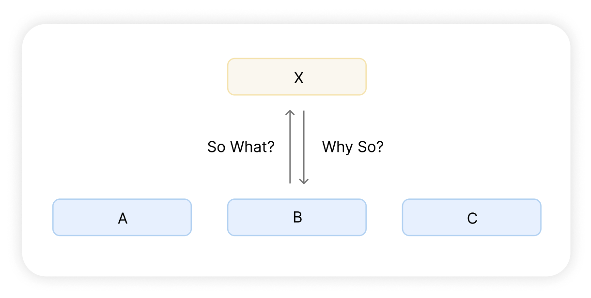

# 제2부 | 논리적으로 사고를 정리하는 기술
- 두 가지 기술 : `MECE`와 `So What?/Why So?`

## 제3장 중복, 누락, 혼재를 방지한다

### 1. MECE는 이야기의 중복, 누락, 혼재를 없애는 기술이다
- **MECE (Mutually Exclusive Collectively Exhaustive)**:
  어떤 내용이나 개념을 중복하지 않으면서도 전체적으로 누락 없는 부분 집합으로 인식하는 것.

#### 세 가지 설명 방법
1. **나열식 접근법**
  - 생각나는 대로, 또는 눈에 띄는 대로 정보를 열거하는 방법.
  - 정보가 많아 청자는 내용이 정리가 안 됐다고 느낄 수 있음.
  - 100가지 이상을 열거했더라도 그것이 전부인지, 누락은 없는지 확인할 방법이 없음.
2. **분류식 접근법**
  - 일정한 규칙하에 외부에서 들어오는 정보를 기계적으로 순서에 따라 분류하는 방법. (예: 요일별, 시간별)
  - 분류별 중복이 생겨 이를 없애는 추가 작업이 필요하며, 작업 후에도 중복 여부를 재확인해야 함.
  - **정보의 중복은 혼란 상태를 알려주는 신호임.**
3. **MECE 접근법**
  - 정보를 **전체 집합**으로 보고 중복/누락 없이 어떤 분류 집합으로 나눌 수 있는지 생각하는 방법.
  - 심각한 중복과 누락을 피할 수 있으며, 듣거나 읽는 사람 입장에서 가장 이해하기 쉬움.
  - 답변의 전체와 그 구성(부분 집합)이 분명하게 명시되어 있어, 부분 집합을 합치면 전체가 됨.
  - 예를 들어 부서에 '들어오는 정보는 크게 정기 정보와 부정기 정보로 나눌 수 있고, 정기 정보는 ...로 부정기 정보는 ...로 분류할 수 있습니다.'로 분류할 수 있음.

#### 다양한 MECE 관점
- 완전히 요소 분해를 할 수 있는 유형(성별, 연령) vs 심각한 중복/누락이 없다고 인정받는 유형.
- 관점의 기준을 다양하게 알수록 그만큼 상대를 설득할 자유로운 선택지가 늘어남.
- 독특한 MECE 관점은 전달자 자신에게 사물을 보는 신선한 시각을 열어주고 창조성을 자극함.

#### MECE 프레임워크 - 3C(4C)
- 시장Customer, 경쟁사Competitor, 자사Company + 유통 채널Channel(4C에 포함).
- 사업이나 기업의 현황 분석에 사용되는 표준 요소로, 이 요소들을 파악하면 현황 전체를 파악한 것으로 간주함.

#### MECE 프레임워크 - 4P
- 특정 고객층을 정한 뒤 어떤 상품을 어떻게 판매할지 마케팅 전략을 세울 때 활용하는 도구.
- 어떤 특성이 있는 상품Product를 어떤 가격Price에 어떤 유통Place을 이용해 어떤 촉진 전략Promotion으로 다가갈지 생각하는 것임.

#### MECE 프레임워크 - 흐름/단계
- 기점에서 종점에 이르기까지의 **단계와 흐름**으로 나누어 파악하는 도구임.
- 기점~종점까지의 과정이나 시간 축(과거/현재/미래 또는 중기/장기)으로 분류함.
- **활용 예시**:
  - **비즈니스 시스템**: 제품 개발부터 시장 투입까지의 단계를 기획, 개발, 생산, 판매 등 기능별로 정리한 것.
  - **인더스트리 체인**: 개별 기업이 아닌 업계 전체를 대상으로 어떤 흐름과 단계로 움직이는지 정리한 것.

#### MECE 프레임워크 - 효율/효과, 질/양
- 사람들은 대책에 있어 효율에만 주목하는 경향이 있지만 효율을 생각할 때는 반드시 효과도 생각해야 함.
- 정보의 적절한 질과 양도 한 쌍의 개념으로 판단해야 함.

#### MECE 프레임워크 - 사실/판단
- 누구도 반론할 수 없는 객관적 사실과 사람마다 다른 관점에서 보는 주관적 판단도 일종의 MECE임.
- MECE의 기준을 많이 알고 있으면 전달자는 자신의 결론을 다양한 방법으로 정리해 상대를 설득할 수 있음.

### 2. 그룹핑은 MECE를 활용한 정보 정리 작업이다
- 그룹핑은 수많은 정보가 흩어져 있을 때 MECE 기준을 찾아내 전체상을 파악하기 쉽게 몇몇 그룹으로 분류하는 작업임.
- **진행 과정**:
  1. 상대를 설득하는 데 도움이 될 정보를 모두 추출.
  2. 의미 있는 MECE 관점에 따라 정리하여 그룹화.
  3. 각 그룹에 제목을 부여 (제목 붙이기 어렵다면 재분류나 기준 변경 필요).
  4. 그룹 제목들을 모았을 때 전체상을 제시하는지, 중복/누락/혼재가 없는지 최종 확인.
- **그룹핑 주의점**:
  - 단순 분류에 그치지 않고, 제목들을 모았을 때 전체가 MECE 관점으로 분류되어야 함.
  - 두 그룹에 동시 속하거나 어디에도 속하지 않는 정보가 있다면 기준이 잘못된 것임.
  - 그룹 간 균형이 전혀 맞지 않는 경우(1:9) 더 세부적인 그룹핑이 필요함.
---
## 제4장 이야기의 비약을 없앤다
### 1. So What?/Why So?는 이야기의 비약을 없애는 기술이다
- `So What?`은 수집한 정보와 소재에서 **결국 어떻다는 것인지** 를 알아내 과제의 답변에 맞는 중요한 **핵심을 추출**하는 작업임.
- 중요한 것은 `So What?`이라는 물음에 준비한 정보와 자료로 확실하게 설명할 수 있어야 한다는 점임.
- `Why So?`는 **왜 그렇게 말할 수 있는지, 구체적으로 무슨 뜻인지**를 **검증**하고 확인하는 것을 말함.

- A, B, C라는 정보를 So What?한 것이 X라면 X에 대해 Why So?로 질문했을 때 A, B, C가 대답이 되는 관계를 만들어야 함.
- 이를 통해 **결론과 방법의 관계를 밀접하게 만드는 것**이 이야기의 비약을 없애는 비결임.
- 설명자가 제시한 정보로 Why So?를 설명할 수 없다면 상대는 이해하기 힘듦.
- **So What?을 하면 반드시 Why So?로 확인해야 함.**

### 2. 두 종류의 So What?/Why So?
1. **관찰의 So What? / Why So?**
  - 사실을 올바르게 관찰하고 요약하여 상대가 똑같이 이해하도록 명시하는 작업.
  - 관찰의 Why So?는 요약된 결과를 요소 분해하여 검증하는 작업임.
2. **통찰의 So What? / Why So?**
  - 자료에서 규칙성, 메커니즘, 대책, 영향 등 종류가 다른 정보를 이끌어내는 작업(가설 수립).
  - **정확한 관찰이 전제되어야 하며**, 새로운 MECE 개념으로 전체상을 바라보며 수행해야 함.

---

### 📝 읽고 나서
- 정보를 단순 나열하기보다 전체 집합과 부분 집합으로 나누어 설명하는 연습해봐야겠다.
- 도표와 같은 자료를 봤을 때 상대도 나와 똑같이 판단할 것이라 속단하지 말아야겠다.