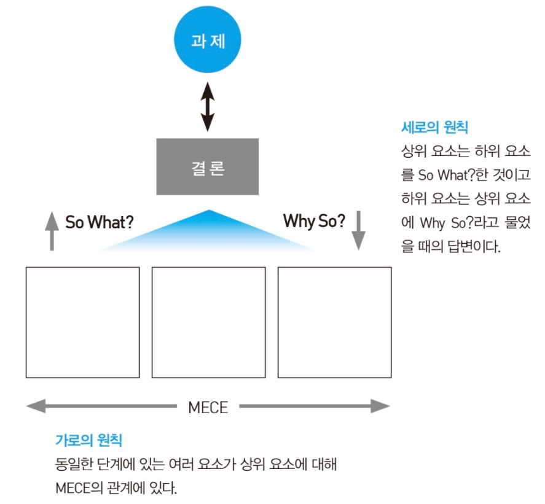
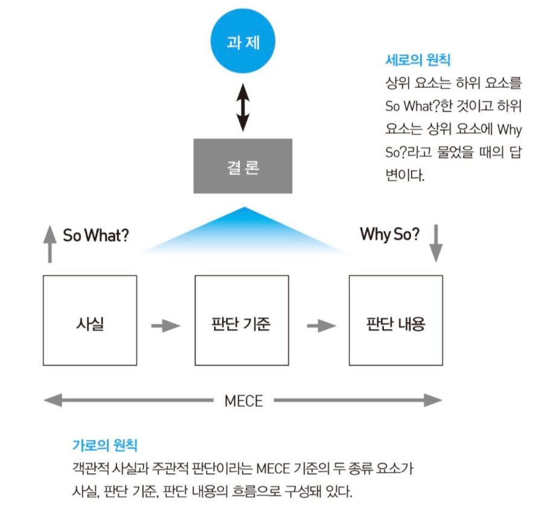

# 제3부 | 논리적으로 구성하는 기술

## 제5장 So What?/Why So?와 MECE로 논리를 만든다.
### 1. 논리란 무엇인가?
- 결론, 근거, 방법이라는 '부품'을 하나의 구조로 맞추어 상대에게 그 관계를 제시하는 논리 구성이 이루어져야 함.
- **논리**란 결론과 근거, 혹은 결론과 방법이 **가로의 법칙(MECE)** 과 **세로의 법칙(So What?/Why So?)** 을 토대로 관계를 형성한 구조를 말함.

#### 세로의 법칙, So What?/Why So?
- **So What?** 은 한 가지 또는 여러 가지 요소 전체에서 알 수 있는 내용을 과제에 맞게 추출하는 작업임.
- **Why So?** 는 결론에 대해 `왜?`라고 물었을 때 원래의 여러 요소 전체가 답변이 되는지 검증하는 작업임.
- 일부 요소만 답변이 된다면 So What?의 관계는 성립하지 않고, 현재 요소 외에 정보나 자료가 더 필요한 경우도 성립하지 않음.
- **`관찰`의 So What?/Why So?**
    - 자료나 정보를 요약하면서 그렇게 말할 수 있는지 없는지를 검증하는 것임.
- **`통찰`의 So What?/Why So?**
    - 관찰의 So What?/Why So?를 수행한 뒤, 과제에 맞게 원래의 자료와는 다른 요소를 추출하고 정말 그렇게 말할 수 있는지 검증하는 것임.

#### 가로의 법칙, MECE
- 상황이나 개념을 전체 집합으로 생각하고, 이를 **중복·누락·혼재 없는** 부분 집합으로 나누어 파악하는 기술임.
- 상대 입장에서 답변이 중복도 누락도 혼재도 없이 명확히 정리되어 있어야 함.

#### 논리의 기본 구조
- **요건 1:** 결론이 과제의 답변이 되어야 함.
    - ex) '현황이 어떠한가?'라는 과제에는 '상황'으로 답변, '참가해야 하는가?'에는 '참여 여부'로 답변하는 것이 타당함.
- **요건 2:** 세로 방향으로는 결론을 정점으로 So What?/Why So?의 관계가 성립해야 함.
- **요건 3:** 가로 방향으로는 동일 계층의 여러 요소가 MECE 관계여야 함.
    - 익숙한 기준보다는 **적합한 기준**을 선택하는 것이 중요함.

### 2. 논리는 간결할수록 좋다
- 논리 구성의 이유는 상대를 이해시키고, **나의 기대대로 상대를 움직이게 하기 위함**임.
- 상대가 충분히 납득할 수 있도록 **과부족 없는 논리**가 필요함.

#### 세로 방향으로는 계층을 얼마나 만들어야 하는가
- **상대가 어디까지 Why So?라는 질문을 던질지 상정**하고, 그에 답변할 수 있을 만큼만 근거와 방법을 계층화하여 준비함.
- 과부족 없이 계층화한 후에는 불필요한 내용은 잘라내야 함.
- 상대의 질문 범위를 모르겠다면, 전달자 입장에서 '상대가 어디까지 이해하면 좋을지'의 관점으로 계층의 수를 판단함.

#### 가로 방향으로는 몇 가지를 어떻게 나눌 것인가
- 동일 계층 내 요소의 수는 많아도 **4~5가지 이하**를 기준으로 하는 것이 효과적임. ➡️ 정밀한 분해가 목표가 아님.
- 근거와 방법을 **중복·누락·혼재 없는 그룹**으로 분류하여 상대가 이해하기 쉽게 전체상을 제시하는 데 의의가 있음.
- 많은 근거를 한 번에 제시하기보다 관점을 정해 소수의 기준으로 정리하면 상대가 논점을 이해하기 쉬워짐.

---

## 제6장 논리 유형을 익힌다
- 논리의 기본 유형: **병렬형**, **해설형**

### 1. 병렬형

#### 병렬형 구조
- 병렬형 논리 유형은 **기본 구조 그 자체**임.
- 결론을 정점으로 이를 뒷받침하는 여러 개의 근거나 방법을 **병렬로 제시**함.
- 근거는 세로로 **So What?/Why So?** 관계를 맺고, 가로로는 동일 단계에서 **MECE** 관계로 구조화됨.

#### 사용상 유의점
- 근거와 방법이 반드시 **MECE**여야 함.
- 설득력의 원천은 근거와 방법이 중복, 누락, 혼재 없이 전개된다는 점에 있음.
- 선택한 **MECE 기준**이 상대를 설득하기에 타당해야 함.

#### 적용 사례
- 과제를 잘 모르거나 관심 없는 상대에게 **논지를 전체적으로 간결하게** 보여주고 싶을 때.
- 결정 사항의 연락 등 결론에 대해 **상대와 논의할 여지가 없는 내용**을 전달할 때.
- 자신의 폭넓은 검토에 **중복, 누락, 혼재가 없음**을 강조하여 설득하고 싶을 때.

---

### 2. 해설형

#### 해설형 구조
- 결론을 정점으로 하되, 근거들 간에 **해설적 관계**를 가짐.
- 가로 방향으로 항상 **세 종류(사실, 판단 기준, 판단 내용)** 의 요소가 일정한 순서로 나열됨.
    - **사실:** 결론을 이끌어내기 위해 상대와 공유해야 하는 객관적 정보.
    - **판단 기준:** 사실에서 결론을 도출하기 위한 전달자의 주관적 잣대.
    - **판단 내용:** 사실을 판단 기준으로 평가한 결과.
- 객관적 근거(사실)와 주관적 근거(판단 기준/내용)로 나뉘는 것이 특징임.
- 여러 대안 중 **왜 이 방법이 최선인지** 타당성을 증명할 때 주로 사용함.

#### 사용상 유의점
- **사실**이 옳아야 하며 MECE로 정리되어 있어야 함.
- **판단 기준**이 명시되어야 하고 그 내용이 타당해야 함.
- 사실 → 판단 기준 → 판단 내용으로 이어지는 **논리 흐름이 일관**되어야 함.

---
## 제7장 논리 유형을 활용한다
### 1. 논리 유형은 이렇게 사용한다
- 실제 논리 구성 시에는 **병렬형과 해설형 논리 유형을 적절히 조합**하여 사용함.

#### 한 가지 과제에 답변할 때
- 과제가 하나일 경우 답변 전체를 병렬형이나 해설형 중 하나로 구성하는 것이 기본임.
- 그러나 결론과 근거만으로 이루어진 **2단계 계층만으로는 상대의 Why So?에 충분히 답변하기 어려운 경우**가 많음.
- 이럴 때는 2단계에 위치한 각 근거와 방법 요소들을 **3단계 하부 구조에서 다시 병렬형이나 해설형으로 구체화**하여 논리 유형을 세로 방향으로 조합해야 함.
- **주요 조합 방식**
  - **전체 논지는 해설형으로 구성하고 하부의 각 논리는 병렬형**으로 구성하는 방식
  - **전체와 하부 모두를 병렬형**으로 구성하는 방식

#### 두 가지 과제에 동시에 답변할 때
- 실제 비즈니스에서는 한 번의 커뮤니케이션에서 **두 가지 과제에 동시에 답변**해야 할 때가 종종 발생함.
- 두 가지 결론을 전달하고자 한다면 각각의 논리 유형을 준비하고 이를 **가로 방향으로 합쳐서 구성**함.
- **조합 방식**
  - **병렬형 + 병렬형:** '무엇을 할 것인가'와 '어떻게 할 것인가'를 각각 MECE한 근거나 방법으로 뒷받침하는 방식임. 결론의 옳고 그름을 논할 필요가 없고, **상대가 내용을 정확히 이해하고 대책을 세우길 바랄 때** 효과적임.
  - **해설형 + 병렬형:** 방향성은 해설형으로 설득하고 구체적 대책은 병렬형으로 제안하는 방식임. **전체 방향성의 타당성을 설득**하거나, 전략의 실현 가능성을 단적으로 보여주고 싶을 때 적합함.
  - **병렬형 + 해설형:** 방향성은 이미 합의된 상태에서 **구체적인 방법의 타당성을 설득**하고자 할 때 효과적임. 어떤 방법을 선택하느냐가 가장 중요한 과제일 때 전달자의 생각을 명시하기 좋음.
  - **해설형 + 해설형:** 왜 이런 결론에 이르렀는지 차분하게 설명하며 **전달자의 의사를 부각**하고 싶을 때 사용함. 다만 상대와 의견 차이가 크다면 첫 번째 과제를 먼저 이해시킨 후 두 번째 과제를 전달하는 것이 바람직함.

### 2. 논리 FAQ

#### Q1. 논리 유형은 자신에게 유리한 정보만 보여주는 것 아닌가요?
- 커뮤니케이션의 논리는 결론을 상대에게 이해시키기 위한 것이므로, **논리 전체가 결론을 도출하는 데 유리하게 구성**되는 것은 당연함.
- 만약 상대가 단점이나 리스크를 우려한다면, 이점만 제시하기보다 **'도입할 때와 도입하지 않을 때의 이점·단점'을 MECE한 기준**으로 준비해야 함.
- '도입 시의 이점이 크고, 도입하지 않을 때의 단점이 크다'는 식으로 **비교를 통해 So What?** 이 되어야 상대의 납득을 끌어낼 수 있음.
- 비즈니스 커뮤니케이션의 목적은 많은 정보를 주는 것이 아니라, **상대가 결론을 납득하고 기대한 반응을 보이게 만드는 것**임을 명심해야 함.

#### Q2. 커뮤니케이션을 할 때, 결론을 먼저 전달하는 것은 아무래도 서구식이라 우리 정서에는 맞지 않다는 의견도 많습니다만..
- **논리의 구조와 메시지의 전달 순서는 별개**이며, 상황에 따라 효과를 고려해 근거부터 전달할 수도 있음.
- 논리 구조는 결론이 다른 요소들과 어떤 관계로 엮여 있는지 명시하는 틀일 뿐, **실제 커뮤니케이션에서의 전달 순서와는 다름.**
- 비즈니스에서는 **결론부터 전달하는 것이 기본**이지만, 상대가 과제에 매우 높은 관심을 보일 때는 결론을 마지막에 언급해도 흥미가 지속될 수 있음.
- 상대가 나와 다른 결론을 지지하여 거부 반응이 예상되거나, **상대가 스스로 결론에 이르도록 유도**해야 할 때는 근거부터 설명하는 방식이 효과적임.
- 어떤 순서로 전달하든 맨 처음에는 **과제와 상대에게 기대하는 반응을 제시**함으로써 커뮤니케이션의 목적을 확실히 밝혀야 함.
- 특히 근거부터 설명할 때는 상대에게 기대하는 반응을 전하고 커뮤니케이션의 목적을 먼저 밝히는 것이 중요한데,
  이를 모른 채 장황한 근거를 듣게 되면 **상대가 조바심을 느껴 논리 요소가 전부 전달되지 못할 가능성**이 높기 때문임.

#### Q3. 보고서를 작성하면서 검토나 분석을 제시할 때 시계열을 적용했으나 상사에게 `결국 무슨 말을 하고 싶은 건가?`라는 말을 들었습니다.
- 자신의 사고 과정이나 **작업 경과를 그대로 나열한 글**은 상대방이 이해하기 매우 어려움.
- 전달자가 겪은 우여곡절을 상대에게 고스란히 경험하게 하면, 상대는 **정보 과부하로 인해 핵심을 파악하지 못하는 소화불량 상태**가 됨.
- 검토 자료들을 **결론-근거라는 논리 구성**과 **병렬형·해설형 유형**에 맞춰 재정리해야 상대가 쉽게 이해할 수 있음.
- 상대를 설득하는 데 **정말로 필요한 정보만을 선별**하여 제시하는 것이 핵심임.

#### Q4. 병렬형으로 작성할 때 어떤 발상으로 MECE 기준을 정하면 좋을까요?
- **답변해야 할 과제** 속에 기준을 정할 실마리가 들어 있음.
- 기본적인 **MECE 프레임워크들을 미리 기억**해두면 상황에 맞게 꺼내 쓰기 좋음.
- 과제의 성격을 정확히 확인하면 그에 적합한 **MECE 기준을 효과적으로 가늠**할 수 있음.

#### Q5. 해설형의 사실에는 정말로 사실만 넣어야 하나요?
- 사실은 일차적으로 객관적인 현상이지만, 넓은 의미에서는 **상대와 이미 합의된 사항**이라면 사실로 간주하고 논지를 전개할 수 있음.

#### Q6. 해설형은 기승전결의 `결`을 먼저 꺼냈을 뿐이라고 생각합니다. 해설형과 기승전결의 차이는 무엇인가요?
- 기승전결은 `전`의 내용이 규정되어 있지 않고, **각 단계 간의 논리적 관계가 애매**한 경우가 많음.
- 해설형은 논지의 기점을 반드시 **객관적인 사실**로 규정하지만, 기승전결의 `기`는 주관이나 객관 여부를 상관하지 않는다는 차이가 있음.

#### Q7. 논리적으로 글을 쓰거나 말하기 위해서는 구체적으로 어떤 훈련을 하면 좋을까요?
- 논리적 메시지 구성 능력은 **훈련의 양에 비례**하여 향상됨.
- 결론을 정점으로 요소를 **세로(So What?/Why So?)와 가로(MECE)의 법칙**으로 구조화하는 습관을 들여야 함.
- **가로와 세로의 관계로 시각화**하여 초안을 작성해보는 연습이 효과적임.

---

### 📝 읽고 나서
- 커뮤니케이션은 결국 상대를 효과적으로 이해시키는 것에 있다.
- 논리적으로 메시지를 구성하는 훈련을 실천할 필요성을 느꼈다.