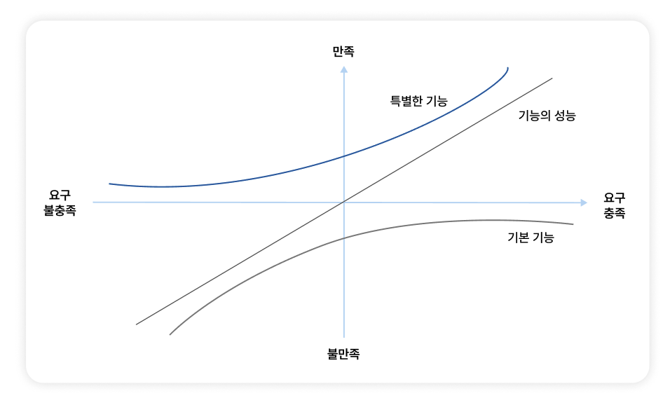

# 6장 | 수주를 돕는 SI 제안서 쓰기

## 01 개발자가 알아야 할 제안서 작성 원칙
- 제안서에서 개발자는 주로 기술 부문을 담당함.
- 단순히 그림을 그리는 것을 넘어 제안 PM이 요구하는 목적, 목표, 전략, 기대효과 등을 작성해야 함.
- 제안 PM이 하는 말을 잘 들어보면 제안서를 어떻게 쓰면 좋을지 알 수 있음.
### 제안요청서 분석
- 제안 PM은 모든 요구 사항을 제안요청서를 기반으로 판단하며, 제안요청서는 실제로 제안서의 답안지 역할을 함.
- 제안요청서는 고객이 제안을 요청하는 문서이기 때문에 제안요청서에는 제안을 요청하는 배경, 사업의 목적, 요구 사항, 목표 시스템, 현재 시스템 등이 적혀 있음.
- 개발자도 제안요청서를 분석해 기술 부문을 더 전략적으로 써야 함.
### 논리적 완결성
- 사업 담당자나 심사위원은 자기와 관련이 있거나 관심 있는 항목, 또는 특정 페이지만 골라 읽음.
- 따라서 각 항목은 앞뒤 페이지를 찾아보지 않아도 그 자체로 내용이 이해될 수 있도록 논리적으로 완결되어야 함.
- 예를 들어 `시스템 구성도` 항목을 작성할 때는 단순히 그림만 넣는 것이 아니라 고객의 요구, 구성 전략, 목표, 특장점, 기대효과를 함께 기술하여 해당 구성안이 도출된 이유를 논리적으로 납득시켜야 함.

## 02 고객의 문제 인식과 제안사의 문제 해결 능력
- 제안서의 시작은 고객의 문제 인식임.
- 고객이 문제를 얼마나 중대하게 혹은 사소하게 여기느냐와 제안사가 보유한 해결 능력의 수준에 따라 제안 전략은 네 가지 방향으로 달라짐.
### 경쟁사와 비교하여 제안하라
- 고객이 문제를 중대하게 인식하고 제안사의 해결 능력이 탁월한 경우, 경쟁사와의 비교표 등을 통해 자사의 강점을 극명하게 부각해야 함.
- 동시에 제안사가 가진 솔루션이 혁신적이면서도 안정적이라는 점도 강조해야 함.
### 일단 동감하고 다른 방안을 제시하라
- 고객은 문제를 중시하지만 제안사의 해결 능력이 상대적으로 미흡하다면, 일단 고객의 인식에 충분히 공감한 뒤 경쟁사와는 전혀 다른 접근 방식을 제안해야 함.
- 경쟁사의 솔루션을 따라 하기보다는 경쟁사의 단점을 보완할 수 있는 대안을 논리적으로 설명해야 함.
- 예를 들어, 경쟁사에게 인공지능 경로 추천 솔루션이 있다면 거기와 다른 방식인 고급 추천 기능을 제안해 해당 방식이 더 좋은 대안임을 논리적으로 설명해야 함.
### 고객이 문제를 중대하게 인식하게 만들어라
- 고객이 사소하게 생각하는 문제를 제안사가 탁월하게 해결이 가능한 경우, 고객이 해당 문제를 중대하게 인식하도록 만들어야 함.
- 기존 방식의 문제를 부각하고, 문제가 중대한 이유를 논리적으로 설명해야 함.
### 경쟁사의 전략을 확인해서 대처하라
- 고객이 문제를 사소하게 생각하고 제안사도 딱히 내세울 솔루션이 없다면 경쟁사의 전략을 미리 확인하는 것도 좋은 방법임.
- 고객이 사소하게 여길지라도 경쟁사에서 문제를 전략적으로 부각하여 질문할 경우를 대비해 사소한 문제에 대한 예상 질문과 답을 준비해두어야 함.

## 03 고객의 요구사항은 변할 수밖에 없다
- 고객의 요구사항은 처음부터 끝까지 모호하고 개발 과정에서 계속 변함.
### 요구사항을 분석하지 말고 제시하라
- 고객은 자신이 원하는 것이 무엇인지 정확히 모르는 경우가 많으므로 개발자가 단순히 요구사항을 듣고 분석하려 하기보다 역으로 대안을 제시하여 고객이 선택하게 만들어야 함.
- 예를 들어 제안요청서에 구현이 불가능한 모순된 요구가 있을 경우, 개발자는 이를 언급함과 동시에 현실적으로 가능한 대안을 구체적으로 제시해야 함.
### 변화하는 요구사항에 대비하라
- 요구사항은 반드시 변하기 때문에 요구사항 정의부터 구현 및 검수까지 걸리는 시간 차이를 최소화하여 고객의 변덕에 대비해야 함.
- 이를 위해 전체 프로젝트를 **투 트랙 방식**으로 운영하는 전략이 필요함.
- 첫 번째 트랙에서는 목표 시스템 전체에 대해 분석-설계-구현-테스트-검수 단계를 밟아 제안요청서 수준의 기본적이고 일반적인 요구사항을 명확하게 정의함.
- 두 번째 트랙에서는 각 기능별로 분석-설계-구현-테스트-검수 단계를 짧게 반복하며, 개발 직전에 세부 활동에 대한 정밀한 요구사항을 점검하고  승인을 받아 곧바로 개발에 착수함.

## 04 고객의 총 만족도를 높이자
- 요구사항은 개발자 관점과 고객 관점이 다름.
- 가장 좋은 것은 개발자의 시간을 적게 쓰면서도 고객의 만족도가 높은 기능을 먼저 개발하는 것임.
- 요구사항을 모두 충족하는 개념보다는 고객의 총 만족도를 높이는 방향으로 접근해야 함.
- 개발자는 기본적으로 기본 기능 요구는 모두 수용해야 하지만 기능의 성능 요구는 한계를 정해야 함.
- 하지만, 고객을 감동시킬 수 있는 특별한 기능을 하나쯤 만드는 것이 좋음.
### 카노 모델

- **기본 기능**: 요구를 충족하지 못하면 고객이 불만족하지만 충족했다고 해서 고객 만족도가 크게 오르지는 않는 유형임.
  - ex) `로그인, 로그아웃 기능`
- **기능의 성능**: 요구를 충족할수록 고객이 만족하고, 충족하지 않으면 고객이 불만족하는 유형임.
  - ex) `웹 페이지 로딩 시간`
- **특별한 기능**: 고객이 그다지 기대하지 않았지만 충족하면 크게 만족하는 유형임.
  - ex) `지문 인식 로그인 기능`
- 같은 요구 충족이라도 시간이 지나면서 고객의 만족도가 달라짐. 과거에 특별했던 기능이 기본 기능으로 느껴질 수 있음.
